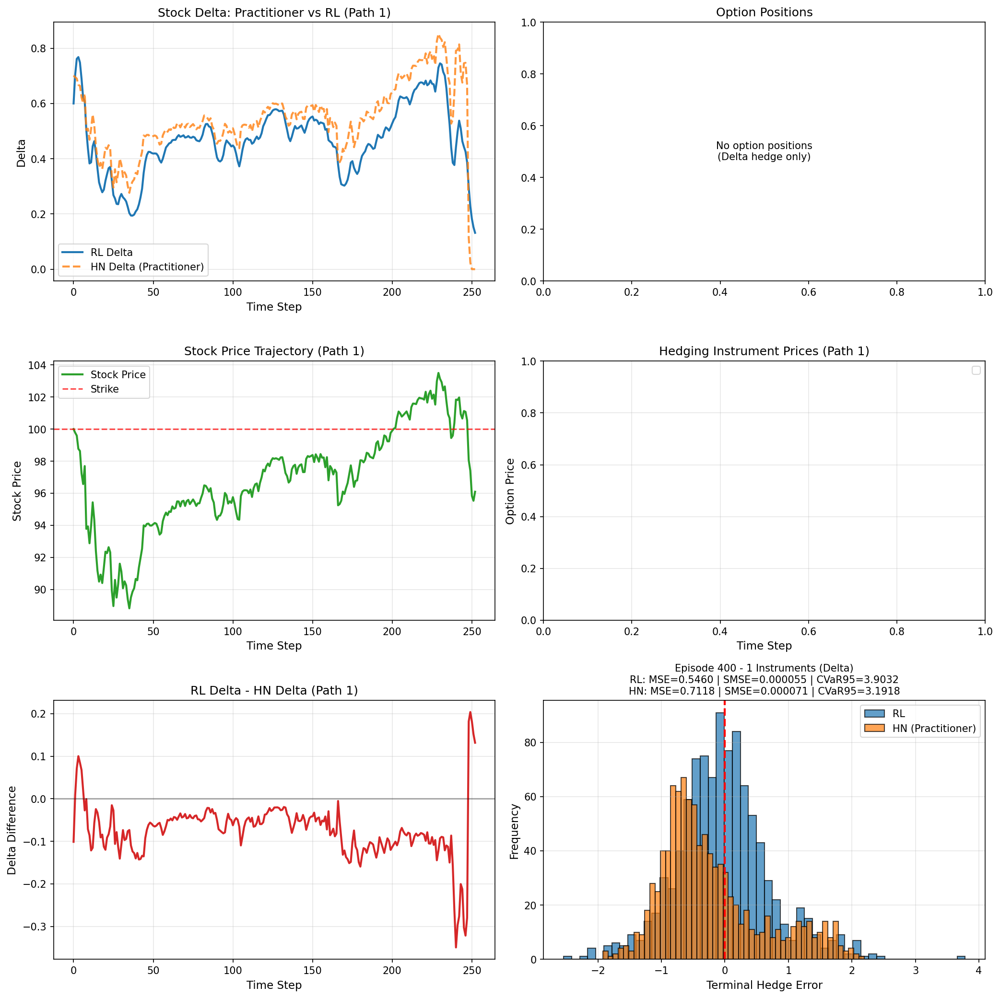
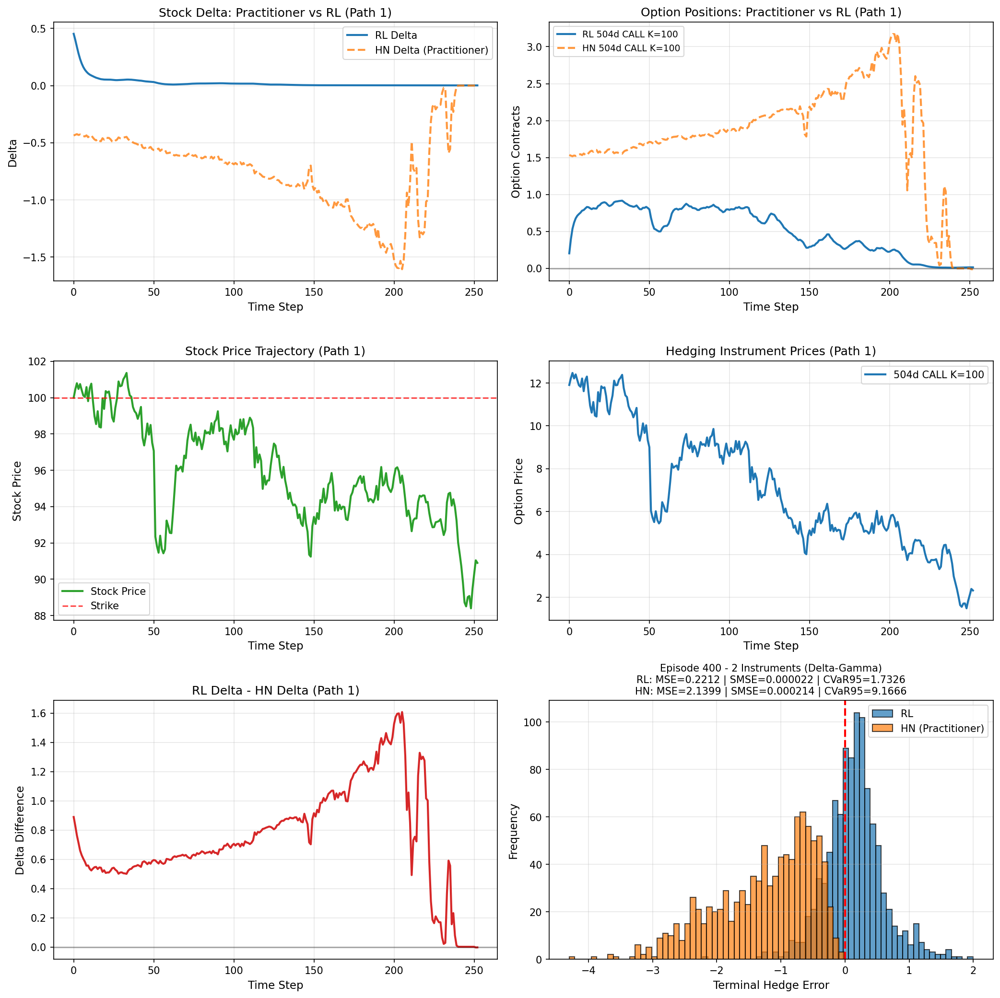
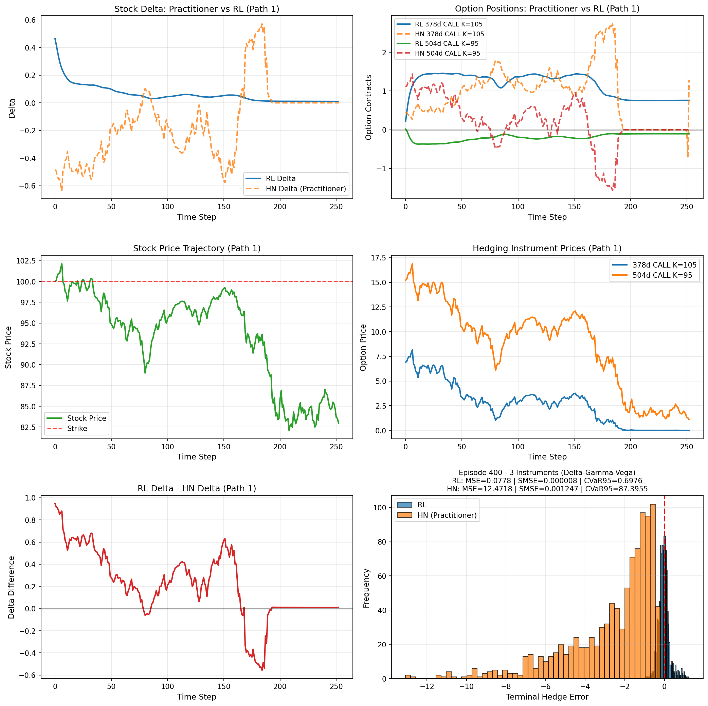

# Deep-Hedging

A reinforcement learning framework for computing optimal dynamic hedging strategies on option portfolios. The agent learns to utilize a portfolio of stocks, bonds, and options at each time step to minimize greek risk (delta, gamma, vega, theta) of a european option, subjected to linear transaction costs.

The simulation scheme utilized is the GARCH(1, 1) model under Heston-Nandi parameters (Can be adjusted).
As a result, option prices and greeks are calculated under the Heston-Nandi framework as well.

## Quick Start
```bash
python train.py --config cfgs/<config_name>
```

## Installation
```bash
pip install torch numpy numba
```

## Results

Visual comparisons of hedging performance across different Greek strategies:

### Delta Hedging


### Delta-Gamma Hedging


### Delta-Gamma-Vega Hedging


## File Structure
```
Deep-Hedging/
├── cfgs/                          # Configuration files
│   ├── configDTC.yaml             # Delta with transaction costs
│   ├── configDGVTC.yaml           # Delta-Gamma-Vega with transaction costs
│   ├── configDGVTTC.yaml          # Delta-Gamma-Vega-Theta with transaction costs
│   └── configDGTC.yaml            # Delta-Gamma with transaction costs
│    
├── models/                        # Pre-trained model weights
│   ├── non-uniform/
│   │   └── GBMLSTM_T.pth
│   └── uniform/
│       ├── GARCHLSTMD.pth
│       ├── GARCHLSTMKAGGLEDG.pth
│       └── GARCHLSTMKAGGLEDGV.pth
│
├── notebooks/                     # Jupyter notebooks and scripts
│   ├── RLHNDGV.ipynb
│   └── deep_training.py
│
├── src/                           # Core source code
│   ├── agents/
│   │   ├── __init__.py
│   │   └── policy_net_garch.py    # RL policy network
│   │
│   ├── option_greek/
│   │   ├── __init__.py
│   │   ├── precompute.py          # Heston-Nandi coefficient precomputation
│   │   └── pricing.py             # Option pricing and Greeks
│   │
│   ├── simulation/
│   │   └── hedging_sim.py         # Hedging environment and dynamics
│   │
│   └── visualization/
│       ├── __init__.py
│       └── plot_results.py        # Result visualization
│
├── train.py                       # Main training script
├── LICENSE
└── README.md
```

## Configuration

Configuration templates are provided in the `cfgs/` directory:
- **configDTC.yaml** — Delta hedging with transaction costs
- **configDGTC.yaml** — Delta-Gamma hedging with transaction costs
- **configDGVTC.yaml** — Delta-Gamma-Vega hedging with transaction costs
- **configDGVTTC.yaml** — Delta-Gamma-Vega-Theta hedging with transaction costs

The letters after "config" represent the abbreviated Greeks (D=Delta, G=Gamma, V=Vega, T=Theta), and "TC" indicates that transaction costs are included in the optimization.

## Models

Pre-trained weights are available in `models/`:
- **uniform/** — Models trained on uniform time grids with Heston-Nandi dynamics
- **non-uniform/** — Models trained on non-uniform grids with GBM dynamics
